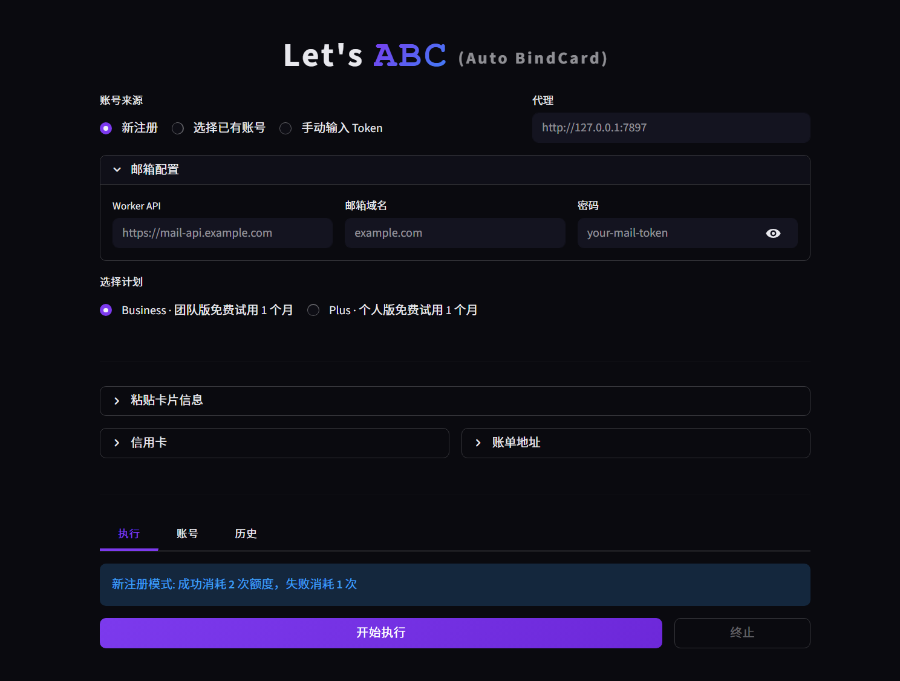

# ABCard — ChatGPT Business / Plus 自动开通

全自动注册 ChatGPT 账号 + 开通 Business 或 Plus 套餐（首月免费），支持 Web UI 操作。

## 展示

> 默认关闭积分系统


<p align="center">
  
</p>


## 功能

- **自动注册** — 临时邮箱创建、OTP 验证、账号注册一条龙
- **首月免费** — Business (`team-1-month-free`) 或 Plus (`plus-1-month-free`)
- **自动支付** — Xvfb + Chrome 自动填写 Stripe 表单、绕过 hCaptcha
- **Web UI** — 粘贴卡片信息即可操作，支持选择已有账号或手动输入 Token
- **计划选择** — 支持 Business (团队版 5席位 $0) 和 Plus (个人版 $0)
- **兑换码管控** — Web UI 需兑换码才能使用，支持次数/有效期限制
- **更多功能不一一列举**

## 工作原理

```
Phase 1: 账号注册 (API)
  MailProvider → 创建临时邮箱
  AuthFlow.run_register() → 10步注册流程
  输出: email, session_token, access_token, device_id

Phase 2: 创建 Checkout Session (API)
  POST /backend-api/payments/checkout
  Business: plan_name=chatgptteamplan, promo_campaign_id=team-1-month-free
  Plus:     plan_name=chatgptplusplan,  promo_campaign_id=plus-1-month-free
  返回: checkout_session_id, publishable_key, client_secret

Phase 3: 浏览器支付 (Playwright CDP + Xvfb + SwiftShader)
  启动 Chrome (有头模式 on Xvfb, navigator.webdriver=false)
  → Cloudflare 通关
  → 填写 Stripe Payment Element (卡号/过期/CVC)
  → 填写 Stripe Address Element (账单地址)
  → 提交 → hCaptcha 自动点击 → 等待激活确认
```

### hCaptcha 绕过原理

Stripe hCaptcha 分两层：
1. **Invisible** (自动) — 若检测到机器人则展示第二层
2. **Visible checkbox** — SwiftShader 软件渲染 WebGL 使其通过，无图片挑战

最好使用 **Xvfb + `--use-gl=angle --use-angle=swiftshader-webgl`**，`--headless=new` 会被识别拦截。

> **注意**: checkbox 自动点击仅在住宅 IP 代理下有效；数据中心 IP（Azure/Vultr 等）会触发图片验证，可能无法自动通过。

## 促销码说明

| 促销 ID | 计划 | 效果 |
|---------|------|------|
| `team-1-month-free` | Business | 首月 $0（5席位）|
| `plus-1-month-free` | Plus | 首月 $0（个人）|

## 配置

复制配置模板并填写你的凭证:

```bash
cp config.example.json config.json
```

编辑 `config.json` 填写:
- `mail.worker_domain` / `mail.admin_token` / `mail.email_domain` — 临时邮箱服务
- `card` — 信用卡信息
- `billing` — 账单地址
- `captcha.client_key` — YesCaptcha API Key (可选, API 模式才需要)
- `proxy` — 代理地址（最好为住宅 IP）
- `code_system_enabled` — 兑换码门禁开关（默认 `false`，无拦截；设为 `true` 启用）

## 快速开始

### 1. 安装依赖

```bash
pip install -r requirements.txt
sudo apt-get install -y xvfb  # 虚拟显示
```

### 2. 安装浏览器

```bash
playwright install chromium
```

### 3. 启动 Web UI

```bash
# 启动 Xvfb 虚拟显示
Xvfb :99 -screen 0 1920x1080x24 -ac &
export DISPLAY=:99

# 启动 UI
streamlit run ui.py --server.address 0.0.0.0 --server.port 8503
```

浏览器访问 `http://localhost:8503`。

### 4. 开发者模式

显示日志、Stripe 响应、高级配置：

```bash
streamlit run ui.py --server.port 8503 -- --dev
```

## 容器化与 GHCR（NAS 推荐）

### 已补齐的缺失配置

- `Dockerfile`（容器构建）
- `docker/entrypoint.sh`（容器内自动拉起 Xvfb + Streamlit）
- `docker-compose.yml`（可直接 `pull + up`）
- `.env.example`（镜像地址/端口/时区）
- `.github/workflows/publish-ghcr.yml`（自动发布到 GHCR，支持 amd64/arm64）
- `requirements.txt` 已加入 `playwright`

### 1) 生成运行配置

```bash
cp config.example.json config.json
cp .env.example .env
```

编辑 `.env`：

- `GHCR_IMAGE=ghcr.io/<你的GitHub用户名>/<仓库名>:latest`
- `STREAMLIT_PORT=8503`（按需修改）

### 2) 发布镜像到 GitHub Packages(GHCR)

推送到 `main` 或打 `v*` 标签后，`publish-ghcr.yml` 会自动构建并推送镜像。

> 首次发布后，需要在 GitHub 仓库的 `Packages` 页面把该容器包可见性改为 `Public`，NAS 才能匿名拉取。

### 3) NAS 上拉取并运行（docker compose）

```bash
mkdir -p /volume1/docker/abcard/{runtime,test_outputs,logs,outputs}
cd /volume1/docker/abcard

# 放入: docker-compose.yml / .env / config.json
docker compose pull
docker compose up -d
```

访问：`http://<NAS-IP>:8503`

### 4) 不用 compose 的直接运行方式

```bash
docker run -d \
  --name abcard \
  --restart unless-stopped \
  -p 8503:8503 \
  -e STREAMLIT_PORT=8503 \
  -e TZ=Asia/Shanghai \
  -e ABC_DB_PATH=/app/runtime/data.db \
  -v $(pwd)/config.json:/app/config.json:ro \
  -v $(pwd)/runtime:/app/runtime \
  -v $(pwd)/test_outputs:/app/test_outputs \
  -v $(pwd)/logs:/app/logs \
  -v $(pwd)/outputs:/app/outputs \
  ghcr.io/<你的GitHub用户名>/<仓库名>:latest
```

## Web UI 使用

1. **输入兑换码**：输入管理员提供的兑换码验证（顶部显示剩余次数）
2. **选择计划**: Business (团队版) 或 Plus (个人版)
3. **选择账号来源**：新注册 / 选择已有账号 / 手动输入 Token
4. **粘贴卡片信息**：支持键值对和纯文本格式自动识别
5. **填写账单地址**：国家/姓名/地址/城市/州/邮编
6. **点击执行**：进度条显示当前步骤，完成后显示结果

## 兑换码管理

使用前需要先生成兑换码:

```bash
# 生成 10 个一次性兑换码
python3 admin_cli.py generate 10

# 生成 5 个可用 3 次的兑换码
python3 admin_cli.py generate 5 --uses 3

# 生成带过期时间的兑换码 (30天)
python3 admin_cli.py generate 1 --uses 99 --expires 30 --note "VIP"

# 查看所有兑换码及使用情况
python3 admin_cli.py list

# 查看单个兑换码详情
python3 admin_cli.py info XXXX-XXXX-XXXX

# 查看执行历史
python3 admin_cli.py history XXXX-XXXX-XXXX
```

### 额度扣减规则

| 模式 | 执行结果 | 净消耗 |
|------|---------|--------|
| 新注册 | ✅ 成功 | **2** (注册+Token查看) |
| 新注册 | ❌ 失败/终止 | **1** (尝试成本) |
| 已有账号 | ✅/❌ | **1** |

## 代码调用

```python
import os, subprocess
from browser_payment import BrowserPayment
from auth_flow import AuthFlow
from mail_provider import MailProvider
from config import Config

# 启动 Xvfb
subprocess.Popen(["Xvfb", ":99", "-screen", "0", "1920x1080x24", "-ac"])
os.environ["DISPLAY"] = ":99"

# 注册账号
cfg = Config()
cfg.proxy = "http://proxy:port"
af = AuthFlow(config=cfg)
mp = MailProvider(cfg.mail.worker_domain, cfg.mail.admin_token, cfg.mail.email_domain)
auth = af.run_register(mp)

# 运行支付
bp = BrowserPayment(proxy=cfg.proxy, headless=False, slow_mo=80)
result = bp.run_full_flow(
    session_token=auth.session_token,
    access_token=auth.access_token,
    device_id=auth.device_id,
    card_number="4242424242424242",
    card_exp_month="03",
    card_exp_year="32",
    card_cvc="123",
    billing_name="John Doe",
    billing_country="US",
    billing_zip="63640",
    billing_line1="123 Main St",
    billing_city="Springfield",
    billing_state="MO",
    billing_currency="USD",
    workspace_name="MyWorkspace",  # Business 模式下用
    chatgpt_proxy=cfg.proxy,
    plan_type="plus",  # "team" 或 "plus"
)
print(f"Success: {result['success']}")
```

## 项目结构

```
auto_bindcard/
├── .github/workflows/publish-ghcr.yml  # GHCR 自动发布
├── docker/entrypoint.sh    # 容器启动脚本 (Xvfb + Streamlit)
├── browser_payment.py     # 核心: 浏览器支付 (Checkout + Stripe 填表 + hCaptcha)
├── auth_flow.py           # API 注册 (10 步)
├── mail_provider.py       # 临时邮箱 + OTP
├── config.py              # 配置管理
├── ui.py                  # Web UI (Streamlit)
├── database.py            # SQLite 数据库层
├── code_manager.py        # 兑换码管理 (生成/验证/计次)
├── admin_cli.py           # 兑换码管理 CLI
├── payment_flow.py        # API 模式支付 (备用)
├── http_client.py         # HTTP 客户端 (curl_cffi)
├── stripe_fingerprint.py  # Stripe 设备指纹
├── browser_challenge.py   # hCaptcha 绕过策略
├── captcha_solver.py      # YesCaptcha 打码服务
├── logger.py              # 日志 & 结果持久化
├── main.py                # CLI 入口
├── test_all.py            # 单元测试
├── config.example.json    # 配置模板
├── docker-compose.yml
├── Dockerfile
├── .env.example
├── requirements.txt
└── README.md
```

## 环境要求

| 组件 | 版本/说明 |
|------|----------|
| Python | 3.10+ |
| Chrome | Playwright 内置 (chromium) |
| Xvfb | 虚拟显示 (`--headless=new` 不可用) |
| 代理 | 最好为住宅 IP |

## 已知限制

1. **可能不支持 `--headless=new`** — HeadlessChrome UA 被检测，Stripe 不加载。最好用 Xvfb。
2. **数据中心 IP 可能无效** — Azure/Vultr 等 IP 会触发 hCaptcha 图片验证，可能无法自动通过，最好使用住宅 IP 代理。
3. **3DS 验证** — 如果卡触发 3D Secure，可能无法自动完成。
4. **卡片被拒** — 如果 Stripe 返回 "支付被拒"，是卡本身的问题，不是代码问题。

## 部署

```bash
# 使用自动部署脚本 (Ubuntu/Debian)
sudo bash deploy.sh
```

脚本会自动创建系统服务、配置 Swap（1G 小机必需）、安装所有依赖。

## License

MIT

📩 Disclaimer | 免责声明
本工具仅供学习和研究使用，使用本工具所产生的任何后果由使用者自行承担。
This tool is only for learning and research purposes, and any consequences arising from the use of this tool are borne by the user.
